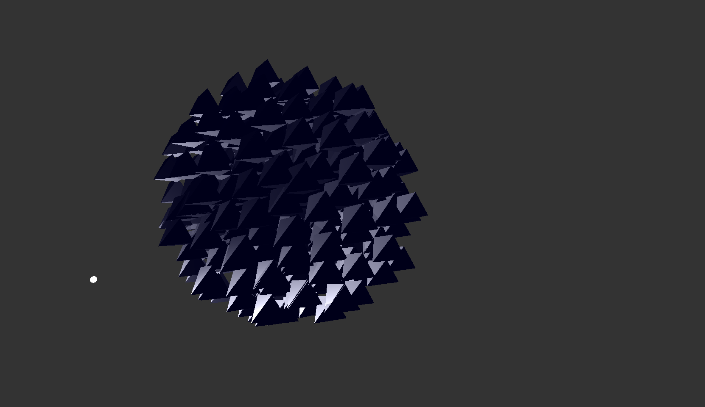
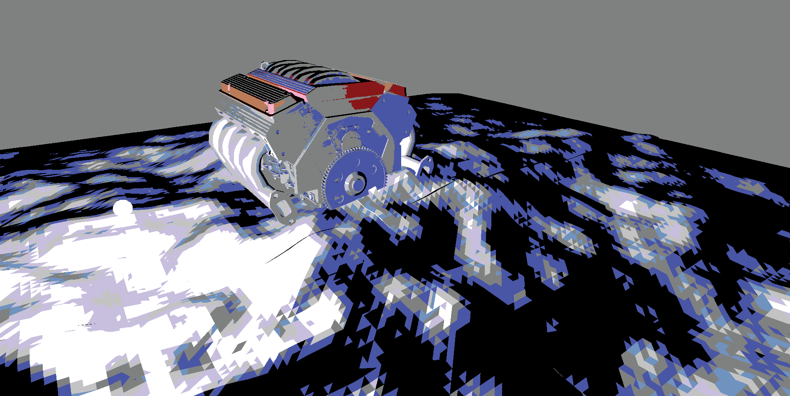
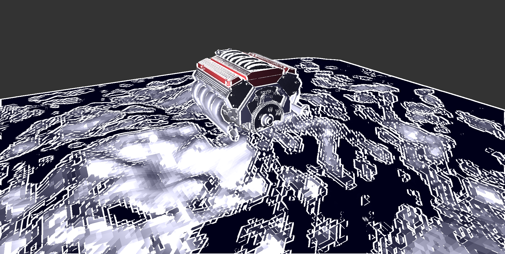

<head>
	<title>Rise And Fall</title>
	
</head>
# Boids Engine
\
This project is an engine made using C++ and OpenGL, using a primitive engine as starting point. I implemented many basic features into the engine. I implemented a Transform class used for the positions of the camera and objects placed in the scene. This Transform makes use of a matrix to store its data. From this I learned a lot about working with matrices and the values inside them, in addition to learning more about other 3D math concepts as well. 

Post-processing has been implemented using framebuffers, and has different effects. The color filter uses a small texture of known color and compares it with fragments onscreen to be set to the closest matching color. The outline filter uses Laplacian edge detection to find large differences in color to detect edges.\
 

I used this engine to implement different implementations of the boids algorithm, in order to test them against each other. In total I created 3 different implementations and a baseline. The baseline places all the models in the scene, but does not do any calculations related to boids.

<video autoplay loop muted playsinline width="100%">
    <source src="../Assets/BE/BEBoidsVideo.mp4" type="video/mp4">
</video>

The first implementation uses an iterative approach, simply looping over every boid on the CPU, the performance of this decreases fast as the number of boids increases, which is why I tested different implementations to improve this performance.

The second implementation uses spacial partitioning to make boids only use nearby boids in their calculations, reducing the complexity. This is done using a KD-Tree, sorting the boids by position and splitting into sections at the median, to equally distribute boids across the tree. 

The third implementation uses a compute shader to calculate the boids on the GPU, where all calculations can occur in parallel. The necessary data (position and velocity) is sent from the CPU to the GPU using a shader storage buffer, where the GPU uses it for its calculation, which the CPU then reads back to update the boids in the scene. 

I recorded performance of these implementations during tests using a tool to write performance data to a file and documented the results, which can be seen in the [GitHub wiki](https://github.com/DeGekkeLamas/AdvRendering/wiki), which shows graphs made from recorded data and explains the results. 

[GitHub wiki ->](https://github.com/DeGekkeLamas/AdvRendering/wiki)\
[GitHub repository engine ->](https://github.com/DeGekkeLamas/RenderingEngines)\
[GitHub repository documentation ->](https://github.com/DeGekkeLamas/AdvRendering) 