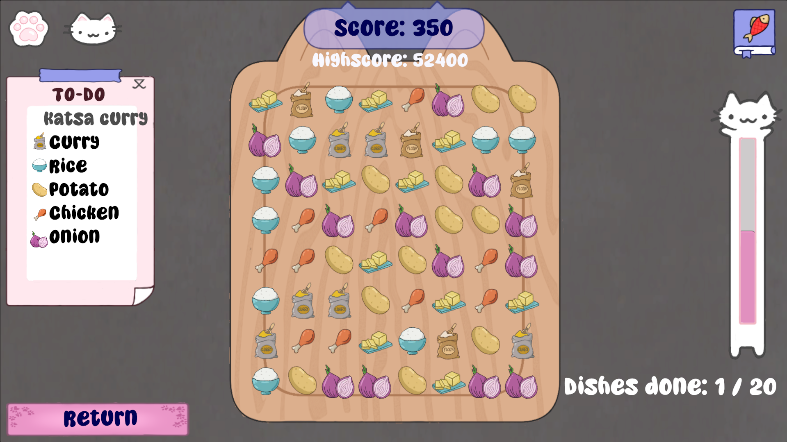

<head>
	<title>Cat Media and Gourmet Technologies</title>
	
</head>
# Cat Media and Gourmet Technologies
\
This game was made as part of a group project, and it is the project I am the happiest with, as I had fun working on it and it's the most complete as a game. The game is a cooking game where you make dishes for customers by collecting ingredients on a grid where you have to match 3 in a row. I worked on the generation of this grid containing the ingredients.

To program the generation of the grid, I had to define the rules by which the grid should be generated, such as pre-existing connections not being allowed, and then translate those rules to code.\
The grid is not allowed to have any pre-made connections in it, so if when generating there are 2 nodes of the same type next to each other, then the node next to it must be a different type, to prevent an already existing match.

The grid also had to make sure the connections required for the dish are actually possible to make, in order to accomplish this, ingredients that are part of the dish are made to be more likely to spawn. It also uses an algorithm to check if all the needed connections are actually present.

Another thing I was responsible was the implementation of the art assets. Because I am an engineer, but also follow artist classes, I know how to work with assets and implement them properly. For the UI, I implemented the sprites for the UI elements and made the different elements, so the designer could easily arrange the pieces in the way they should be.

[Itch.io page ->](https://degekkelamas.itch.io/catmediaandgourmettechnologies)\
[GitHub repository ->](https://github.com/ArthurVanIttersum/DeGekkeLamas) 