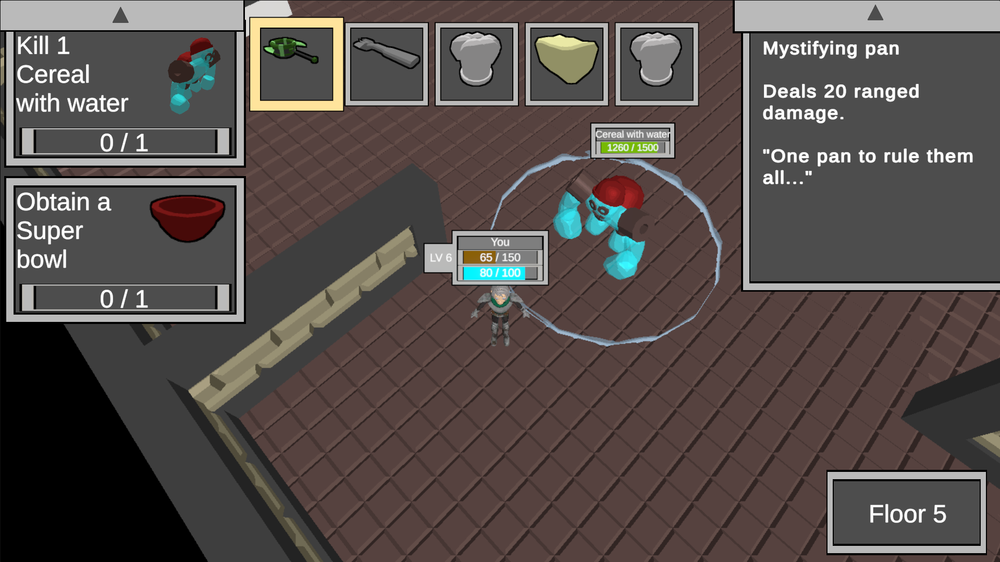

<head>
	<title>Dining Dungeons</title>
	
</head>
# Dining Dungeons
\
Dining Dungeons is a game I made as a personal project for school, and in the game you go through procedurally generated dungeons, collecting items, defeating enemies and completing quests. The development of this game was composed of many topics together.

It's quite a large project, but that means I also learned a lot from it. I learned principles behind shaders and their math, including the applications of that math in different contexts, how to solve problems using efficient algorithms and how to make code easy to reuse and maintain.

<video autoplay loop muted playsinline width="100%">
    <source src="../Assets/DiDu/DiDuVideoDungeonGeneration.mp4" type="video/mp4">
</video>
First of all, it uses algorithms to generate the dungeon you play in. This algorithm works by generating the bounds of the dungeon, and splitting it into rooms until there are no rooms left to split. It then places doors at areas where rooms intersect. After this it uses a BFS-based search to ensure all rooms can be reached, and unreachable ones are removed.\
There is a setting to remove the smallest few rooms from the dungeon, when enabled this will sort the rooms by size and check for all the rooms if the same amount of rooms can be accessed without this room as with this room.\
After the data for the dungeon is done being generated, the actual assets will be placed. It does this by making a tilemap of the rooms and doors, and then using marching squares for the walls and floodfill, originating from the starting room, to generate the floor. The interior of the rooms is made by selecting on which sides counters should be placed, and when placing them, checking if it would be too close to any door.

On top of this I had to make sure the code in the project is easily modifiable and reusable. To do this I applied various design patterns, such as the strategy pattern, observer pattern and event bus pattern.\
The code is very modular, and scripts like the movement and attack patterns of enemies can easily be swapped out.\
Models and views are separated, with events being used for presenters of data to update their display. Events are used widely throughout the project to avoid coupling where it isn't needed. This way it is easier to modify and add to existing code.

Finally, the game also uses self-made shaders, using both HLSL and ShaderGraph. Examples of this are the cell-shade applied to most objects in the scene, the projectile chart that appears when holding a lobbed item, the vertex shader that stretches projectiles and the splat that appears when an enemy is defeated.\
The code for lighting calculations is placed in a .hlsl file, with the shader files including it to use its functions for lighting. This way I can avoid code duplication and make it easier to reuse and maintain.\
The cell-shade effect is made by rounding off the calculated lighting to the nearest fraction of the amount of loops set in the material settings. The function for this is also in the Lighting.hlsl file, this way special shaders that should still have the cell-shade effect, such as the VelocityStretch shader, can also use it.\
The splat shader used for puddles dropped by enemies is made using a ShaderGraph, it uses Perlin noise and refines it to get the shape of the puddle, using the position as offset, it then uses a calculation similar to that of the cell-shading shader to achieve the layered effect. The wave effect spawning by some weapons and enemies also uses this shader, but applied to a cylinder or sphere instead of a quad.

<video autoplay loop muted playsinline width="100%">
    <source src="../Assets/DiDu/DiDuVideoExplosion.mp4" type="video/mp4">
</video>
Video of an explosive item being used, showing multiple shaders in action.

[Itch.io page ->](https://degekkelamas.itch.io/dining-dungeons)\
[Public repository ->](https://github.com/DeGekkeLamas/Algorithms-Shaders) 

