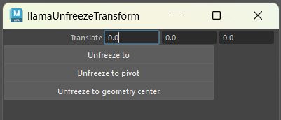
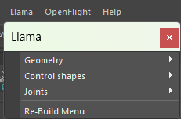

<head>
	<title>Maya plugins</title>
	
</head>
# Maya Plugins
Maya MEL, individual project\
\
For this project, I made a collection of scripts that can be used in Maya for general utility. These scripts are made in MEL, Maya's scripting language. 

The scripts are made to be a handy tool that's easily accessible. In order to do that I made them accessible via a shelf in the UI, that has sections for all different\

Because I was still learning the language Maya uses for scripting, I started with very small and simple scripts to get familiar with it. An example of this are the script I made to change the colors of multiple curve objects at once. The logic of it was simple, making it a good exercise to get started, but the script still makes for a useful tool to use when rigging, as Maya does not have an option for this normally. 

\

[Download and installation guide ->](https://github.com/DeGekkeLamas/MayaPlugins/)