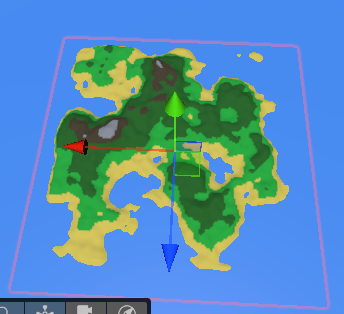
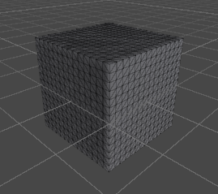
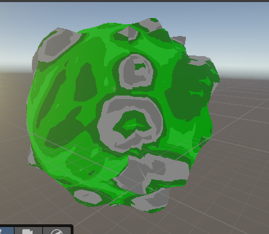
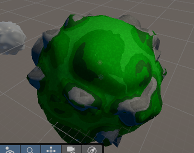

<head>
	<title>Planet Generation</title>
	
</head>
# Planet Generation
\
This project was made for a subject where the goal was to make a portfolio item to present. I decided to make procedural planets for it, as procedurally generated terrain is very interesting to me. Before immediately going into 3D terrains, I first tried 2D terrain generation to get familiar with it.

\
To start, I did research on how games usually handle terrain generation. Using this research, I first made the island in the picture above. This island is far simpler than the target end-product and serves as practice for me to understand the principles.

First I had to make noise for the terrain to base its height off. For the planets, I had to use 3D noise due to the planet being round. I could have tried to project the sphere into a 2D map, but this would result in noticeable seams, so I decided to use 3D noise.\
This process is quite similar between 2D and 3D, so I was able to apply knowledge from the island exercise to the 3D planet generation. The initial, unrefined noise is bad for terrain, so I had to refine it to make the noise more smooth, to give better looking terrains. 

After the noise was made, I could move on to generating the mesh. For this I had to first generate a model for a sphere. For this it was important to have the vertices be spread evenly across the entire sphere, in order for the level of detail to be consistent on the model. I decided to use the technique of generating a cube, but normalizing all the vertices so they are the same distance away from the center, giving the result of the images below. By generating it this way, I could apply the techniques for generating and triangulating the quad from the 2D terrain onto this.\
 \
After having generated a sphere, I could add the noise to it. To do that I made it get the value of the noise at the position of the original vertex, so I could then multiply the position with the value from the noise, to increase the distance from the vertex to the center of the planet. 

After having generated the model for a planet, I had to texture the planets and decided to do this in a shader. This shader gets the steepness of terrain by calculating the dot product of the surface normal and the position of the vertex. I'm using steepness instead of height because this looks more realistic, as it avoids grassy terrain on very steep areas or rocky terrain on flat areas. 

For this project I worked on terrain generation, to procedurally generate planets using 3D noise. I also textured the planets generated using a shader, using the steepness of the terrain for the texture and added 2D noise to give the texture more variety. To make this I had to research principles of terrain generation and how to refine noise into being usable.\
 \
As this texture looks quite bland, I decided to add noise to the texture. The picture above on the left shows without any shading or added noise, the one on the right shows a planet with added noise and shading. This is also done using 3D noise, but the key differences are that is uses an HLSL library for it instead of a C# one, as it's a shader. This noise is not refined, as it is not needed in this situation and would be unneeded calculations. 

After having learned and applied all of these steps, I successfully make a system to procedurally generate planets and texture. From this I learned a lot about how to work with noise-based procedural generation. 