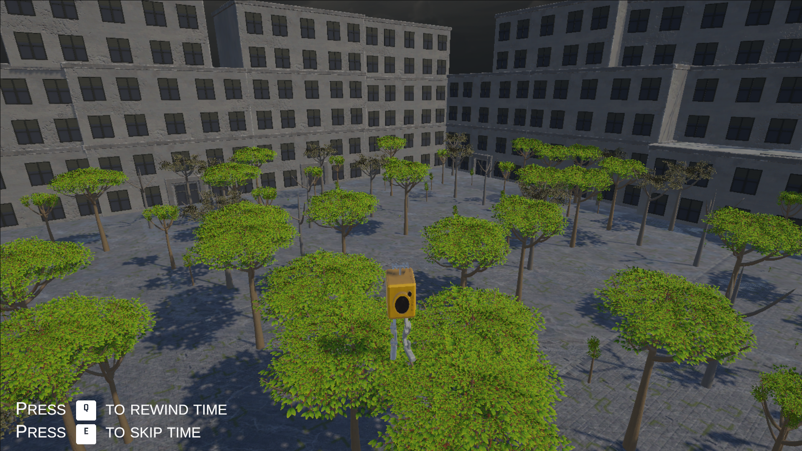

<head>
	<title>Rise And Fall</title>
	
</head>
# Rise And Fall
\
This game was made for a gamejam, with a time-limit of 48 hours. The theme of the jam was "Future". Our idea for it was a game where you travel forward in time, to make trees grow so you can use them as platforms. For the gamejam I was in a team of 6 people in total, with 1 other engineer. 

For the game I mainly worked on gameplay elements. I made the player controller and implemented the rig for it. As I hadn't implemented a 3D rig before, I had to learn how to work with it first and learn how to troubleshoot with rigs. 

I also made the mechanic to forward and backward time, which works by disabling the current tree object and enabling the object that belongs to the tree 1 stage older or younger. 

[Itch.io page ->](https://degekkelamas.itch.io/riseandfall)