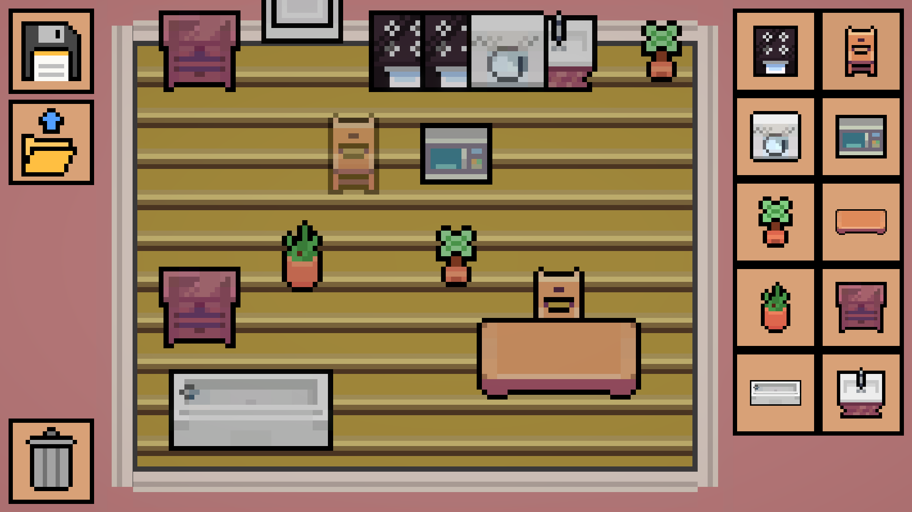
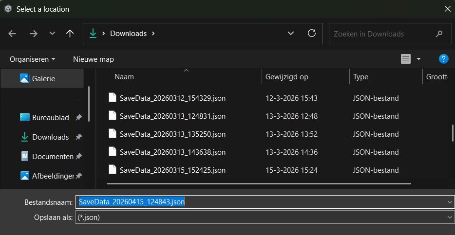

<head>
	<title>Rise And Fall</title>
	
</head>
# Room Decorator
\

I made this project in order to learn more about making systems to save complex data, where Unity's UserPrefs will not suffice. The game I created allows you to decorate a room by placing furniture in it and has options to save and load your room. This saving is done by exporting it as a JSON file to a location specified by the user. To load back a save, the game lets the user open a file from a specified location. 
\

Because the location of the file read from is determined by the user, it was important to ensure no errors would occur in case of corrupted files, as the user is free to edit the file how they want. Without error prevention, the game would be crash in cases such as selecting a wrong file, or if the file had been edited in another software to be unreadable. 

[Itch.io page ->](https://degekkelamas.itch.io/roomdecorator)