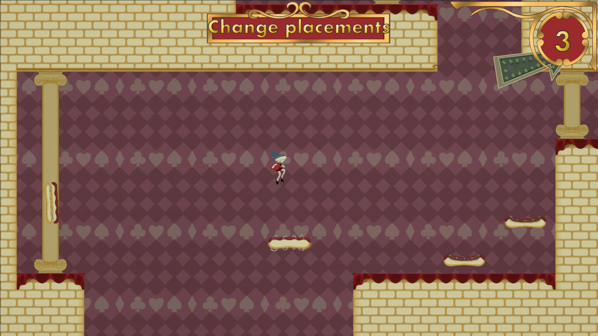
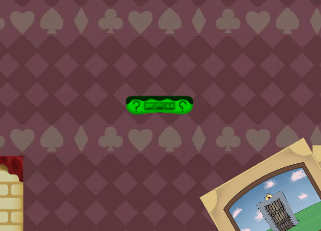
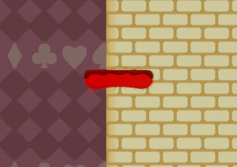
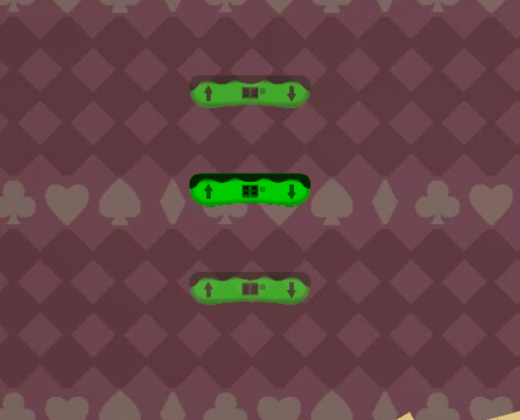

<head>
	<title>The Devils Gambit</title>
	
</head>
# The Devils Gambit
\
This game was made as part of a group project where the goal was to make a vertical slice of a game as prototype. The game we made is a platformer where the player needs to place platforms that have special effects. 

I worked on the player controller and its mechanics. For movement, the player checks if there are colliders in the direction it wants to move in, using a boxcast. For jumping it uses a simiar system, except it checks the terrain normal to check if the jump would be valid. This way it's not possible to jump up while near or inside walls, which would be possible if the terrain normal did not get checked. If the playings jumps while in the air and next to a wall, the player will walljump. For this the same mechanics are used. 

<video autoplay loop muted playsinline width="100%">
    <source src="../Assets/TDG/TDGPlayerAnimations.mp4" type="video/mp4">
</video>
For the player I also implemented animations. I made animation files from the character sprites and implemented those into an animation controller. The player controller then passes in certain values, such as current movement and if the player is falling, to determine which animations should be played at what moment. 

In addition to this, I also implemented the tiles created by the artist into the tileset, so they could easily be placed in levels. The tiles can easily be replaced if needed, by simply overriding the original file, making it easy to test out different colors or textures for the tiles.

  \
I also made a couple of the effects the placed platforms give, and made the system for placing them and previewing the placement, with moving platforms also displaying their range of movement.

[Itch.io page ->](https://degekkelamas.itch.io/thedevilsgambit)